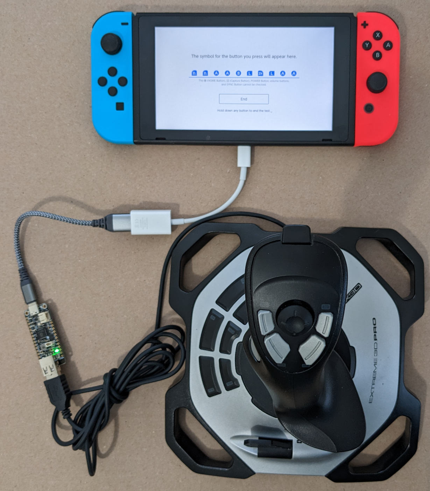

# Nintendo Switch One Hand Controller

This program converts a Logitech Extreme 3D Pro flight joystick to a Nintendo
Switch compatible gamepad. This allows a player to play two thumb stick games
using one hand. No soldering required. This does not work for any other flight
stick.

Joystick        |Gamepad
----------------|-------
X               |Left joystick X
Y               |Left joystick Y
Twist           |Right joystick X
Hat             |Right joystick Y <#1>
Slider          |unused
Front trigger   |A
Side trigger    |B
Small left      |L (trigger)
Small right     |R (trigger)
Big left        |Y
Big right       |X
Base 7          |ZL (throttle)
Base 8          |ZR (throttle)
Base 9          |-
Base 10         |+
Base 11         |LSB (joystick button)
Base 12         |RSB (joystick button)

Note #1: Move the hat switch forward/back to move the right joystick
forward/back. Moving the hat switch in other directions has no effect.

## Hardware

The Feather RP2040 and joystick are powered by the Nintendo Switch so a battery
is not needed. Just plug the joystick into the Feather RP2040 then plug the
Feather RP2040 into the Switch.

* Adafruit Feather RP2040 with USB Type A Host
* Logitech Extreme 3D Pro flight joystick

## Easy Install

This is the best option if you do not want to change the code.

Put Adafruit board in UF2 bootloader mode. https://learn.adafruit.com/adafruit-feather-rp2040-with-usb-type-a-host/pinouts#buttons-and-rst-pin-3143253

Drag and drop switch_onehand.ino.adafruit_feather_usb_host.uf2 on to the USB
drive named RPI-RP2. Wait a few seconds for the board to finish flashing the
code. The board is ready to be used with a Nintendo Switch and Logitech joystick.

## Dependencies

Install the following libraries using the IDE Library manager.

* "Adafruit TinyUSB Library"
* "Pico PIO USB"

Install the following library by downloading a zip file from github.com then
use the IDE "Add .ZIP library" option to install it.

* https://github.com/touchgadget/switch_tinyusb/

## IDE Tools options required

* Set "Board" to "Adafruit Feather RP2040 USB Host"
* Set "USB Stack" to "Adafruit TinyUSB"
* Set "CPU Speed" to 120MHz.

## Case for the RP2040 Feather with USB Type A Host board

https://learn.adafruit.com/case-for-feather-rp2040-usb-host
